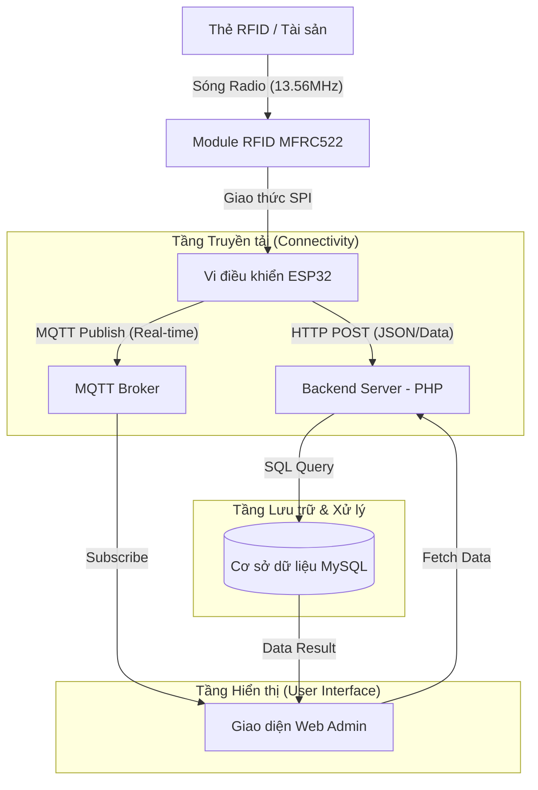

# Hệ thống Quản lý Tài sản & Giám sát Thông minh sử dụng Công nghệ RFID

## 📌 Giới thiệu Tổng quan
Dự án này tập trung vào việc xây dựng một giải pháp **Quản lý Tài sản thông minh** dựa trên công nghệ nhận dạng qua tần số vô tuyến (RFID). Hệ thống cung cấp khả năng định danh, theo dõi và quản lý vòng đời của tài sản trong các môi trường như kho bãi, văn phòng hoặc khu vực kiểm soát an ninh.

---

## 🔄 Luồng dữ liệu hệ thống (Data Flow)

Để hiểu rõ cách hệ thống vận hành từ lúc quét thẻ đến khi dữ liệu hiển thị trên trang web, chúng ta có thể theo dõi sơ đồ luồng dữ liệu sau:

### Giải thích chi tiết:
1.  **Thu thập dữ liệu**: Khi thẻ RFID (tài sản) đưa vào vùng từ trường, Module MFRC522 đọc mã UID và gửi về ESP32 qua giao diện SPI.
2.  **Truyền tải đồng thời**:
    *   **HTTP POST**: Dữ liệu được gửi đến `esppostdata.php` để thực hiện các nghiệp vụ như ghi nhận thời gian vào/ra, tính phí và lưu vào Database.
    *   **MQTT**: ESP32 gửi một bản tin đến Broker (MQTT Dashboard). Giao diện web (Dashboard) sẽ nhận (Subscribe) bản tin này để cập nhật trạng thái "Live" ngay lập tức mà không cần tải lại trang.
3.  **Lưu trữ & Hiển thị**: Dữ liệu được lưu trữ bền vững tại MySQL. Admin truy cập web sẽ xem được báo cáo, lịch sử và trạng thái tổng quan dựa trên dữ liệu đã lưu.

---

## 🛠 Thành phần Hệ thống

### 1. Phần cứng (Hardware) - Tầng Thu thập Dữ liệu
*   **Bộ vi điều khiển ESP32**: Trung tâm xử lý, tích hợp WiFi.
*   **Đầu đọc RFID MFRC522**: Hoạt động ở tần số HF (13.56MHz).
*   **Thẻ RFID (Tags/Cards)**: Định danh duy nhất cho từng tài sản.

### 2. Phần mềm & Web (Software) - Tầng Quản lý & Hiển thị
*   **Backend (PHP)**: Xử lý API, nghiệp vụ logic và quản lý MySQL.
*   **Frontend (HTML5, CSS3, JS, Sass)**: Dashboard theo dõi thời gian thực.
*   **Tích hợp Thanh toán (VNPay)**: Hỗ trợ thanh toán trực tuyến.

---

## 🔬 Phân tích Công nghệ: Từ Thử nghiệm đến Thực tế

### 1. So sánh LF/HF (Bãi xe) vs UHF (Quản lý kho)
*   **Mô hình bãi xe (LF/HF)**: Tầm gần, độ ổn định cao, tránh đọc nhầm.
*   **Mô hình quản lý kho (UHF)**: Tầm xa (10-15m), quét hàng loạt nhưng dễ gặp hiện tượng **"Stray Reads" (Quét nhầm)**.

### 2. 04 Giải pháp Chống đọc nhầm (Stray Reads)
1.  **Ăng-ten định hướng (Directional Antennas)**: Khu trú sóng vào luồng cửa kho.
2.  **Cảm biến hồng ngoại (IR Sensors)**: Chỉ kích hoạt quét khi có vật thực tế đi qua.
3.  **Thuật toán RSSI & Phase**: Xác định hướng di chuyển Vào/Ra.
4.  **Điều chỉnh công suất (Power Tuning)**: Giới hạn tầm quét vừa đủ tại khu vực cửa.

---

## 🚀 Quy trình:
1.  **Nhận dạng**: Tài sản đi qua trạm, thẻ RFID được nhận diện.
2.  **Truyền tin**: ESP32 gửi dữ liệu về Server qua HTTP/MQTT.
3.  **Xử lý**: Kiểm tra trạng thái, ghi nhận thời gian và phí.
4.  **Báo cáo**: Theo dõi trực quan trên Web và xuất báo cáo.

---
*Dự án được phát triển nhằm tối ưu hóa quản trị tài sản thông qua IoT, đảm bảo tính minh bạch và chính xác.*

GVHD:   Nguyễn Duy Xuân Bách

Sinh viên thực hiện:              
Thân Quán Nguyên	MSSV:20521682       
Trần Lê Anh		    MSSV:20520138      
Hoàng An Thế		MSSV:20521939
